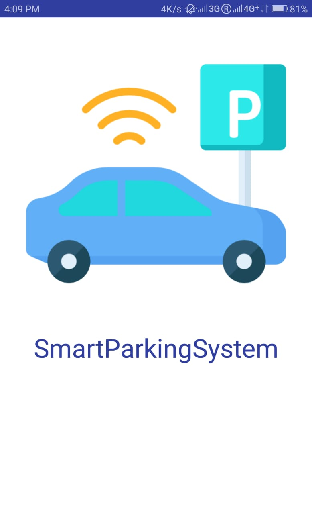
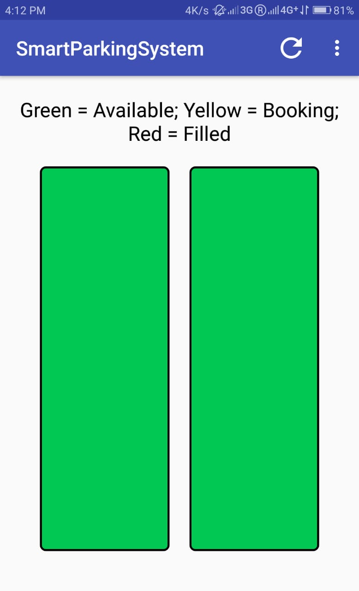
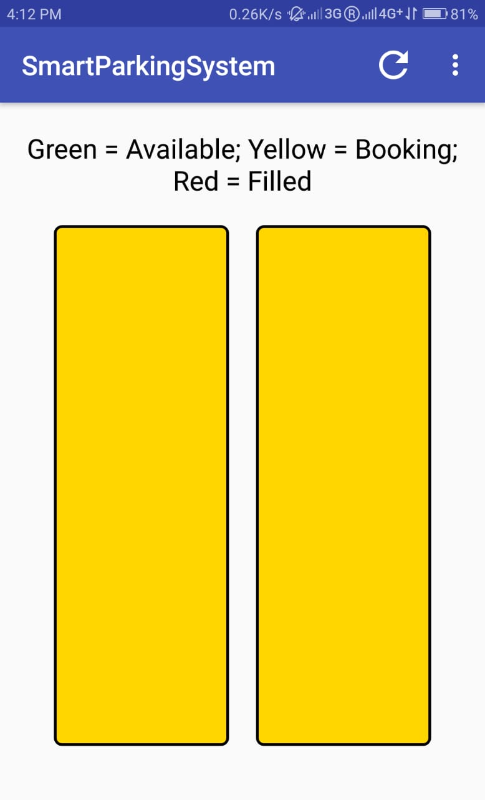
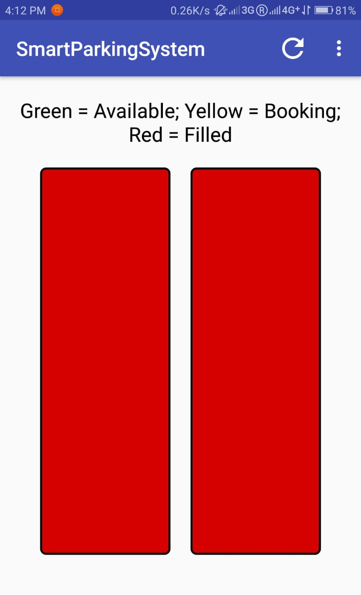
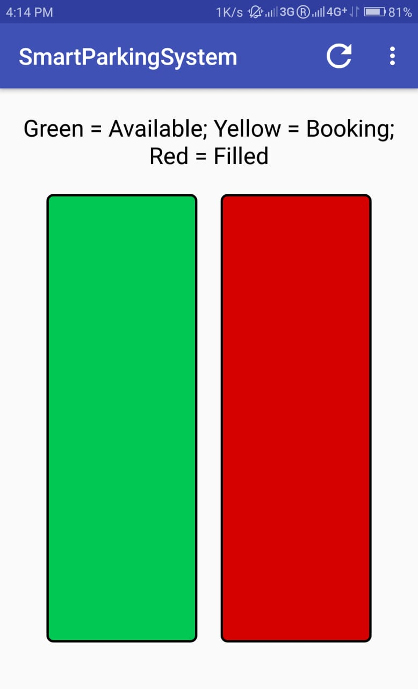

# Smart Parking System
This is the Android Application for a Smart Parking System in which we can see all the slots, their availability, and can book a slot, according to the availablity of the slot.

## Description
Parking facilities has become a huge problem. There is lack of proper infrastructure for parking spaces detection and allocation. There has been increase in the number of vehicles, but without sufficient parking spaces.
So the objectives our system is to the above problem by making a system which can detect free parking spaces and accordingly allocate to the user, through an Android Application.

The hardware to detect a slot is based on NodeMCU, an Arduino Uno with built-in Wi-Fi capabilities, a magnetometer for each parking slot, and Zigbee modules for communication. On the software side, a user has an Android Application.

## Advantages
1. This system removes the hassle of moving through the whole parking area to find an empty spot.
2. It will be easy to find your vehicle if the position is known.
3. If a user knows the schedule beforehand, he/she can book the slot in advanced and not worry about finding a parking spot at that time.

## Working
1. The hardware detects the availability of slot by using a magnetometer sensor, to detect the presence of a vehicle. When the reading of sensor changes, the change is reflected on the Firebase database.
2. The Android application accesses the Firebase database to see whether the slot is available or not. A slot in the application can have 3 modes.
    - Available: Shown as a `Green` slot in the application, when the parking slot is vacant.
    - Booked: Shown as a `Yellow` slot in the application, when the parking slot is vacant but has been booked by a user.
    - Filled: Shown as a `Red` slot in the application. when the parking slot is filled.

## Screenshots
    
